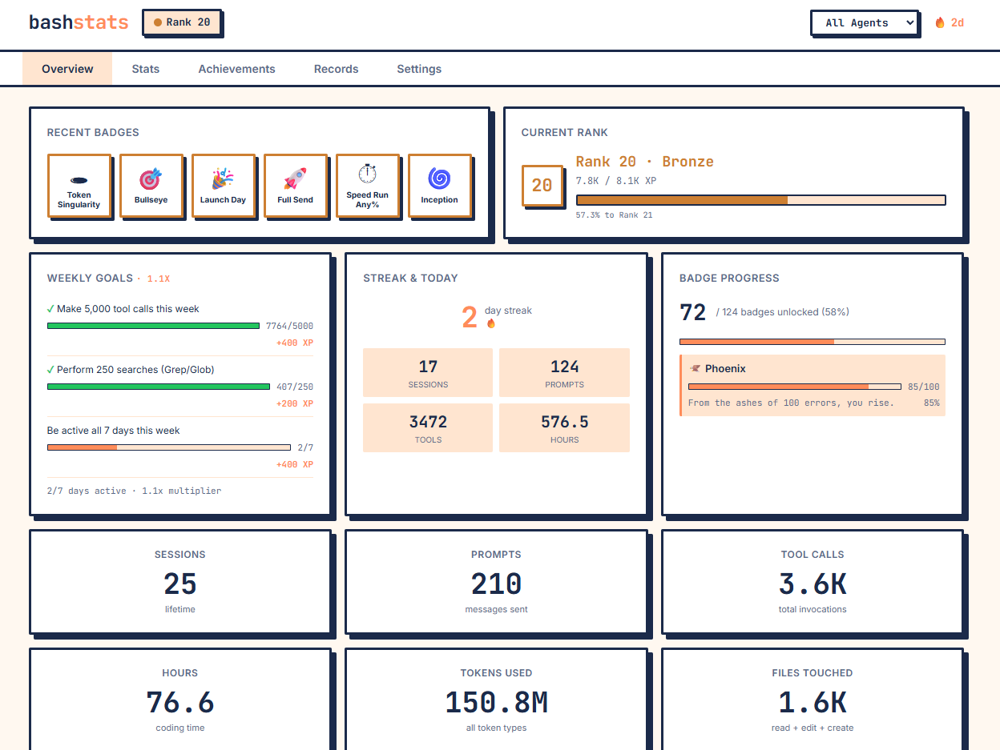

# bashstats


Track every prompt, tool call, and late-night coding session. Earn badges. Build streaks. Climb 500 ranks from Bronze to System Anomaly.

bashstats hooks into Claude Code and quietly records everything — sessions, prompts, tool usage, errors, tokens, and streaks. It turns all of it into stats,
124 achievements, weekly goals, and a dashboard you'll check way too often.
  
## Install

```bash
npm install -g bashstats
bashstats init
```

`bashstats init` installs Claude Code hooks and creates the local database at `~/.bashstats/bashstats.db`. Stats begin recording immediately.

## CLI Commands

| Command | Description |
|---|---|
| `bashstats init` | Install hooks and set up database |
| `bashstats stats` | Quick stat summary in your terminal |
| `bashstats achievements` | List all badges with progress bars |
| `bashstats streak` | Show current and longest daily streak |
| `bashstats web` | Launch the browser dashboard |
| `bashstats export` | Export all data as JSON |
| `bashstats reset` | Wipe all data |
| `bashstats uninstall` | Remove hooks and data |

### Options

```bash
bashstats web --port 8080    # Custom port (default: 17900)
bashstats web --no-open      # Don't auto-open browser
```

## Dashboard

The browser dashboard at `http://localhost:17900` includes:

- **Overview** - Recent badges, rank progress, stat cards, activity heatmap, and recent sessions at a glance
- **Stats** - Lifetime totals, tool breakdowns, time analysis, session records, and project stats in a 2x2 grid
- **Achievements** - All 124 badges with tier progress, organized by category
- **Timeline** - Activity heatmap and session history with sparkline charts

## What Gets Tracked

bashstats hooks into 12 Claude Code events:

| Event | What it records |
|---|---|
| SessionStart | Session creation, project, agent type |
| UserPromptSubmit | Prompt content, character/word counts |
| PreToolUse | Tool invocations (Bash, Read, Edit, etc.) |
| PostToolUse | Tool results and exit codes |
| PostToolUseFailure | Failed tool calls |
| Stop | Session end time and duration |
| Notification | Errors and rate limits |
| SubagentStart | Subagent spawns |
| SubagentStop | Subagent completions |
| PreCompact | Context compactions |
| PermissionRequest | Permission prompts |
| Setup | Initialization events |

## Achievements


124 badges across 16 categories, each with 5 tiers: Bronze, Silver, Gold, Diamond, Singularity. Tiers are calibrated for year-long progression — Bronze in your first week, Singularity after 12+ months.

### Volume (5)
- **First Prompt** - Submit prompts to Claude
- **Tool Time** - Make tool calls
- **Marathon** - Spend hours in sessions
- **Wordsmith** - Type characters in prompts
- **Session Vet** - Complete sessions

### Tool Mastery (7)
- **Shell Lord** - Execute Bash commands
- **Bookworm** - Read files
- **Editor-in-Chief** - Edit files
- **Architect** - Create files
- **Detective** - Search with Grep and Glob
- **Web Crawler** - Fetch web pages
- **Delegator** - Spawn subagents

### Time & Patterns (10)
- **Iron Streak** - Maintain a daily streak
- **Night Owl** - Prompts between midnight and 5am
- **Early Bird** - Prompts between 5am and 8am
- **Weekend Warrior** - Weekend sessions
- **Witching Hour** - Prompts between 2am and 4am
- **Lunch Break Coder** - Sessions during lunch hour
- **Monday Motivation** - Monday sessions
- **Friday Shipper** - Git commits on Friday
- **Timezone Traveler** - Unique hours with activity in a day
- **Seasonal Coder** - Code through all four seasons

### Session Behavior (6)
- **One More Thing** - Extended sessions (1hr+, 15+ prompts)
- **Quick Draw** - Sessions under 2 minutes with tool use
- **The Pivot** - Sessions using 5+ distinct tool types
- **Context Crunch** - Context compaction events
- **Permission Slip** - Permission request events
- **The Returner** - Days with 5+ sessions on the same project

### Behavioral (5)
- **Creature of Habit** - Repeat your most-used prompt
- **Explorer** - Use unique tool types
- **Planner** - Use plan mode
- **Novelist** - Write prompts over 1000 characters
- **Speed Demon** - Complete sessions in under 5 minutes

### Prompt Patterns (6)
- **Minimalist** - Short prompts (under 10 words)
- **Question Master** - Prompts ending with a question mark
- **The Apologizer** - Prompts containing "sorry"
- **CAPS LOCK ENERGY** - Fully uppercase prompts
- **Emoji Whisperer** - Prompts with emoji
- **Code Dump** - Prompts with 50+ lines

### Resilience (3)
- **Clean Hands** - Longest error-free tool streak
- **Resilient** - Survive errors
- **Rate Limited** - Hit rate limits

### Error & Recovery (5)
- **Rubber Duck** - Tool failure followed by success without edits
- **Third Time's the Charm** - Success after 2+ consecutive failures
- **The Undoer** - Back-to-back edits on the same file
- **Crash Test Dummy** - Sessions with 10+ errors
- **Phoenix** - Total lifetime errors survived

### Tool Combos (5)
- **Read-Edit-Run** - Read, Edit, Bash sequences
- **Grep Ninja** - Total Grep and Glob searches
- **File Factory** - Max files created in a session
- **The Refactorer** - Max edits to a single file across all sessions
- **Search and Destroy** - Grep/Glob followed by Edit

### Shipping & Projects (4)
- **Shipper** - Make commits via Claude
- **PR Machine** - Create pull requests
- **Empire** - Work on unique projects
- **Polyglot** - Use different programming languages

### Project Dedication (5)
- **Monogamous** - Max sessions on a single project
- **Project Hopper** - Max unique projects in a day
- **The Finisher** - Projects with commits followed by inactivity
- **Legacy Code** - Return to a project after 30+ days
- **Greenfield** - Total unique projects initialized

### Multi-Agent (12)
- **Buddy System** - Use concurrent agents
- **Hive Mind** - Total subagent spawns
- **Swarm Intelligence** - Max concurrent subagents
- **Micromanager** - Subagents stopped within 30 seconds
- **The Orchestrator** - Total subagent spawns across all sessions
- **Agent Smith** - Max subagents in a single session
- **Polyglot Agent** - Use multiple CLI agents
- **Gemini Whisperer** - Complete sessions in Gemini CLI
- **Copilot Rider** - Complete sessions in Copilot CLI
- **Open Source Spirit** - Complete sessions in OpenCode
- **Agent Hopper** - Use different agents on multiple days
- **Double Agent** - Use 2+ agents on the same day

### Wild Card (12)
- **Please and Thank You** - Polite prompts
- **Wall of Text** - Prompts over 5,000 characters
- **The Fixer** - Max edits to a single file
- **What Day Is It?** - Sessions exceeding 8 hours
- **Copy Pasta** - Duplicate prompts submitted
- **Error Magnet** - Max errors in a single session
- **D&eacute;j&agrave; Vu** - Same prompt submitted twice within 5 minutes
- **Trust Issues** - Read immediately after Write on the same file
- **Backseat Driver** - Prompts with numbered step-by-step instructions
- **The Negotiator** - Prompts containing "try again" or "one more time"
- **Rubber Stamp** - Max consecutive permission requests
- **It Works On My Machine** - Bash success after a previous Bash failure

### Token Usage (10)
- **Token Burner** - Total tokens consumed across all sessions
- **Output Machine** - Total output tokens generated
- **Cache Royalty** - Total cache read tokens
- **Context Crafter** - Total cache creation tokens
- **Token Whale** - Most tokens in a single session
- **Heavy Hitter** - Sessions exceeding 1M total tokens
- **Featherweight** - Lean sessions under 50K tokens with tool use
- **Token Velocity** - Average tokens per session
- **Prolific** - Most output tokens in one session
- **Input Flood** - Total raw input tokens

### Aspirational (Singularity-only) (12)
- **The Machine** - 100,000 total tool calls
- **Year of Code** - 365-day consecutive streak
- **Million Words** - 10 million characters typed
- **Lifer** - 10,000 sessions completed
- **Transcendent** - 100,000 total XP
- **Omniscient** - All tool mastery badges at Singularity tier
- **10,000 Hours** - 10,000 hours in sessions
- **The Architect** - 1,000+ files created
- **Eternal Flame** - 180-day consecutive streak
- **The Collector** - Every non-secret, non-aspirational badge unlocked
- **Centimillionaire** - 100 million characters typed
- **Token Billionaire** - 1 billion total tokens consumed

### Secret
17 hidden badges unlocked by specific behaviors. Discover them yourself.

## Rank System

500 numbered ranks with an exponential XP curve. Early ranks come fast; the top 100 are a serious grind.

**Formula:** `cumXP(N) = floor(10 * N^2.2)`

| Tier | Ranks | Approx. Time |
|------|-------|-------------|
| Bronze | 1-100 | First few months |
| Silver | 101-200 | ~3-4 months |
| Gold | 201-300 | ~6-9 months |
| Diamond | 301-400 | ~12-18 months |
| Obsidian | 401-499 | Each rank takes weeks |
| System Anomaly | 500 | 2+ years |

**XP sources:** prompts (+1), sessions (+5), hours (+10/hr), streaks (+5/day), badge tier unlocks (50-1000), and weekly goals.

## Weekly Goals

Two systems that stack for bonus XP:

**Activity Multiplier** -- XP bonus based on days active this week:

| Days Active | Multiplier |
|-------------|-----------|
| 1-2 | 1.0x-1.1x |
| 3-4 | 1.2x-1.3x |
| 5-6 | 1.5x-1.75x |
| 7 | 2.0x |

**Challenge Cards** -- 3 rotating challenges generated each Monday from a pool of ~25. Complete them for bonus XP (100-300 per challenge). Examples: "Use 5+ tools in one session", "Submit 50 prompts this week", "Hit a 7-day streak".

## Agent Support

bashstats works with multiple AI coding agents. `bashstats init` auto-detects installed agents and sets up hooks for each one.

| Agent | Detection | Token Tracking |
|-------|-----------|----------------|
| Claude Code | Always installed (default) | Full (input, output, cache) |
| Gemini CLI | `~/.gemini` directory exists | Approximate (total only) |
| Copilot CLI | `copilot` binary available | Not available |
| OpenCode | `~/.config/opencode` exists | Not available |

All agents share the same `~/.bashstats/bashstats.db` database. The dashboard agent dropdown filters stats by agent, and the overview tab shows a breakdown when multiple agents are in use.

### How it works

- **Claude Code** - Hooks installed in `~/.claude/settings.json`
- **Gemini CLI** - Hooks installed in `~/.gemini/settings.json`
- **Copilot CLI** - Hook config written to `~/.copilot/hooks/bashstats-hooks.json`
- **OpenCode** - Plugin installed at `~/.config/opencode/plugins/bashstats.ts`

`bashstats uninstall` removes hooks from all agents.

## Data Storage

All data is stored locally in `~/.bashstats/bashstats.db` (SQLite with WAL mode). Nothing is sent anywhere. Tables:

- `events` - Every hook event with full context
- `sessions` - Session lifecycle (start, end, duration, counts, token usage)
- `prompts` - Prompt content and word/char counts
- `daily_activity` - Aggregated daily stats
- `achievement_unlocks` - Badge tier unlock timestamps
- `weekly_goals` - Weekly challenge cards and completion status
- `weekly_xp` - Weekly XP totals with multiplier tracking

## Tech Stack

- TypeScript + Node.js 18+
- SQLite via `better-sqlite3`
- Express for the dashboard server
- Commander for the CLI
- tsup for bundling
- vitest for tests

## Development

```bash
git clone https://github.com/GhostPeony/bashstats.git
cd bashstats
npm install
npm run build
npm link
bashstats init
```

## License

MIT
